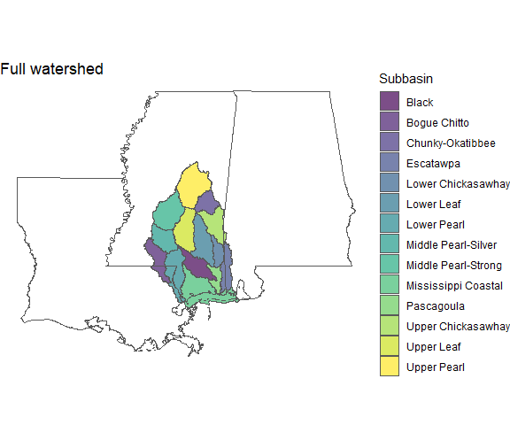
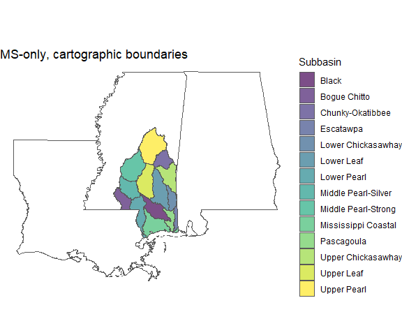

<!-- README.md is generated from README.Rmd. Please edit that file -->

# msepBoundaries

<!-- badges: start -->
<!-- badges: end -->

The `msepBoundaries` package is a collection of several spatial data
frames delineating Mississippi Sound Estuary Program (MSEP) boundaries
in different ways.

## Installation

You can install the development version of msepBoundaries from
[GitHub](https://github.com/) with:

``` r
# install.packages("pak")
pak::pak("CMEP-MS/msepBoundaries")
```

## Examples

Here are a couple of examples. First load the libraries:

``` r
library(msepBoundaries)
library(ggplot2)
library(dplyr)
#> 
#> Attaching package: 'dplyr'
#> The following objects are masked from 'package:stats':
#> 
#>     filter, lag
#> The following objects are masked from 'package:base':
#> 
#>     intersect, setdiff, setequal, union
library(tigris)
#> To enable caching of data, set `options(tigris_use_cache = TRUE)`
#> in your R script or .Rprofile.
options(tigris_use_cache = TRUE)
lamsal <- states(cb = TRUE) |> 
    filter(NAME %in% c("Mississippi", "Alabama", "Louisiana"))
#> Retrieving data for the year 2021
```

### Full Outline

The outline of the entire watershed.

``` r
ggplot() +
    geom_sf(data = outline_full,
            fill = "blue",
            alpha = 0.5) +
    geom_sf(data = lamsal,
            fill = NA) +
    theme_void()
```


### Subbasins

Subbasins (HUC8) for the entire watershed.

The outline of the entire watershed.

``` r
ggplot() +
    geom_sf(data = subbasins_full,
            aes(fill = name),
            alpha = 0.5) +
    geom_sf(data = lamsal,
            fill = NA) +
    theme_void()
```



### Land-only subbasins, and only Mississippi

In case we want to ignore the large area of water that is the
Mississippi Sound, and restrict the area to the state of Mississippi.

``` r
ggplot() +
    geom_sf(data = subbasins_ms_land,
            aes(fill = name),
            alpha = 0.5) +
    geom_sf(data = lamsal,
            fill = NA) +
    theme_void()
```


